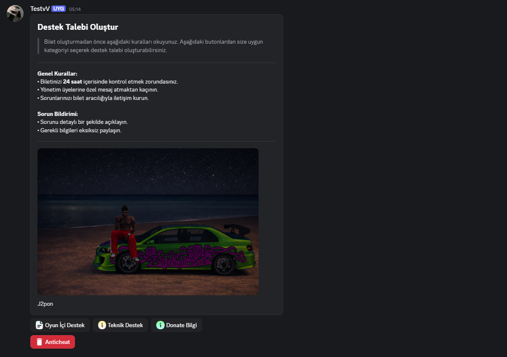
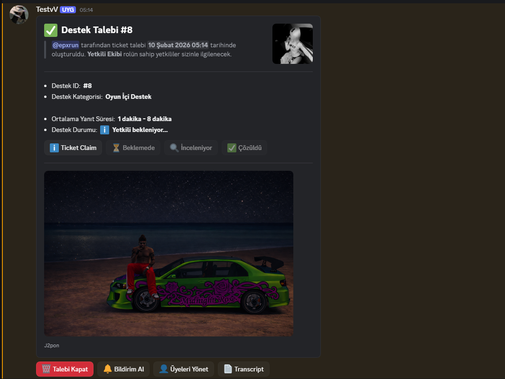

# Destek Talebi Discord Botu

Discord sunucunda **destek ticket sistemi** kuran bot. Panelden kategori seçerek ticket açılır; her ticket kanalında Components V2 veya embed + butonlarla talep yönetimi yapılır. İsteğe bağlı **MongoDB** ile tüm talepler ve istatistikler kaydedilir.

---

## Kurulum

### Gereksinimler

- **Node.js** 18+
- **Discord** uygulaması ve sunucu yönetim yetkisi
- İsteğe bağlı: **MongoDB** (ticket kayıtları ve `/ticket-top`, `/ticket-stat` için)

### 1. Projeyi hazırlama

```bash
# Bağımlılıkları yükle
npm install
```

### 2. Discord uygulaması

1. [Discord Developer Portal](https://discord.com/developers/applications) → **New Application** ile uygulama oluştur.
2. **Bot** sekmesinden bot ekle; **Reset Token** ile token al.
3. **Privileged Gateway Intents** bölümünde **Message Content Intent** açık olsun.
4. **OAuth2 → URL Generator**:
   - Scopes: `bot`, `applications.commands`
   - Bot Permissions: **Manage Channels**, **View Channel**, **Send Messages**, **Manage Messages**, **Read Message History**, **Embed Links**, **Attach Files**
5. Oluşan link ile botu sunucuna davet et.

### 3. Ortam değişkenleri

Proje kökünde `.env` dosyası oluştur:

```env
# Zorunlu: Discord bot token
DISCORD_TOKEN=buraya_bot_tokenini_yapisti

# İsteğe bağlı: ticket kayıtları ve istatistik komutları için
MONGODB_URI=mongodb://localhost:27017/ticketbot
```

### 4. Çalıştırma

```bash
npm start
```

Bot açıldıktan sonra sunucuda **Kanal Yönet** yetkisi olan biri `/ticket-kur` ile paneli gönderebilir.

---

## Özellikler

| Özellik | Açıklama |
|--------|----------|
| **Ticket paneli** | `/ticket-kur` ile tek mesajda kurallar + kategori butonları (Components V2 veya embed yedek). |
| **Kategoriler** | Oyun İçi Destek, Teknik Destek, Donate Bilgi, Anticheat vb. — `index.js` içinde `TICKET_SETUP.categories` ile düzenlenir. |
| **Ticket ID** | Her açılan ticket **MongoDB**’de kaydedilir; ID, **kategorideki kayıt sayısına** göre otomatik artar (#1, #2, #3…). |
| **Tek ticket kuralı** | Aynı kategoride kullanıcının açık talebi varsa yeni ticket açılmaz. |
| **Ticket Claim** | Yetkili “Ticket Claim” ile talebi devralır; mesajda “@Yetkili devraldı” görünür. |
| **Durum butonları** | Beklemede, İnceleniyor, Çözüldü ile talep durumu güncellenir. |
| **Bildirim Al** | @here veya @yetkili-rol ile kanala bildirim atar. |
| **Üyeleri Yönet** | Ticket kanalına kullanıcı ekle/çıkar (select menu). |
| **Transcript** | Son 50 mesajı `.txt` dosyası olarak indirir. |
| **Talebi Kapat** | Ticket kanalını siler; MongoDB’de `closedAt` ve `status: closed` güncellenir. |
| **MongoDB** | `tickets` ve `ticket_events` koleksiyonlarına yazım; `/ticket-top` ve `/ticket-stat` bu veriyi kullanır. |

---

## Komutlar

| Komut | Yetki | Açıklama |
|-------|--------|----------|
| **`/ticket-kur`** | Kanal Yönet | Destek panelini bu kanala gönderir. Paneldeki butonlarla kategorilere göre ticket açılır. |
| **`/ticket-top`** | — | (MongoDB gerekir) `tip: açan` → en çok ticket açanlar; `tip: yetkili` → en çok devralan yetkililer. |
| **`/ticket-stat user:@kullanıcı`** | — | (MongoDB gerekir) Kullanıcının açtığı ve devraldığı ticket sayıları. |
| `!menu` / `!liste` | — | Liste menüsü ve gezinme butonları. |

---

## Ayarlar (`index.js`)

- **`TICKET_CONFIG`**  
  Ticket mesajı görünümü: `authorName`, `footerText`, `defaultImageUrl`, `roleId` vb.

- **`TICKET_SETUP`**  
  - **categories:** Her kategori için `categoryId` (Discord kategori kanal ID), `name`, `emoji` (isteğe bağlı custom emoji).  
  - **supportRoleId:** Ticket kanallarına otomatik erişim verilecek yetkili rol ID’si.  
  - **footerText**, **panelImageUrl**, **thumbnailUrl:** Panel metin ve görselleri.

Kanal adı formatı: `kullaniciadi-kategorislug-numara` (örn. `j2pon-oyunici-1`).

---

## Örnek Görseller

Aşağıya projeden ekran görüntüleri ekleyebilirsin. Görselleri `screenshots/` klasörüne koyup aşağıdaki yolları güncellemen yeterli.

### Panel (Destek Talebi Oluştur)

<!-- Görsel: /ticket-kur ile gönderilen panel -->


### Açılmış ticket mesajı

<!-- Görsel: Ticket kanalındaki destek talebi mesajı (Components V2 veya embed + butonlar) -->


